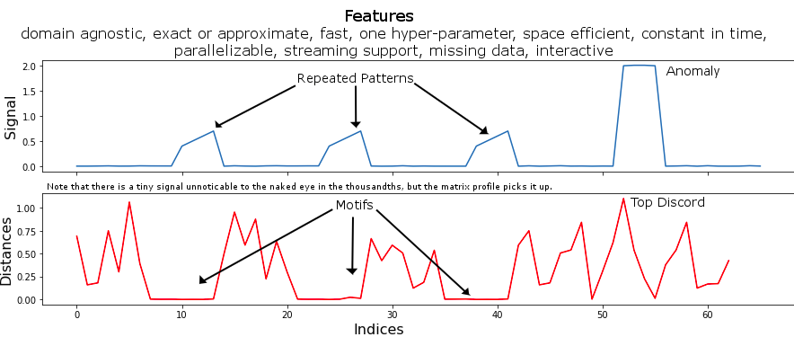
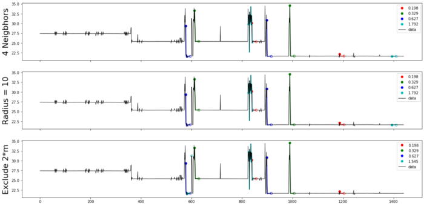

# Detection Regime of Energy Usgae from Time Series Data using Matrix Profile

## Problem Satement

Recent advances in time series classification and forecasting such as Prophet, Matrix Profile, Recurrent Neural Network brought sophisticated tools to the support of the visibility and control of energy consumption at the device level. For example, identifying pattern of usage episodes overlaid on asset energy consumption can help to compare usage periods by location, type of equipment, and even individual device. However in real-life problem domain every situation is different and therefore using frequency domain or statistically modeling techniques, for example, to find patterns of energy consumption will require domain specific knowledge and to have labels on data which sometimes can bottleneck the motif search process. In this article I show a new technique that’s based on matrix profile to detect episodes of electricity usage and return the timestamps at which each episode stars and stops.

## Data set and problem description

In this example we show energy consumption data from a pharmaceutical equipment over the course of a typical 24-hour day. Power consumption is measured in watts. The behavior of the device being measured is fairly typical: during episodes of active usage, power consumption quickly increases from an “idle” or background level of consumption, and then returns to idle power draw after usage ceases. Power consumption is noisy and variable in general. It is also fairly common for the “background” consumption of equipment to be variable over time, noisy, and to change such that you cannot rely on a single measurement or value.

## General Conclusion

- By correcting the matrix profile with a Domain specific Annotation Vector based on the active power consumption peaks measure, we were able to discover the true motifs.
- After fine tuning the parameters of motifs.motifs, we were able to differentiate different motifs existing in the data.
- Visually we have one false positive : the red motif in the right, which we refer to noise. We can improve the result by adding a noise filter on the found motifs.

 

For Detail visit: https://medium.com/@mohcine.madkour/regime-detection-in-energy-data-using-matrix-profile-6d22862a1fd4
